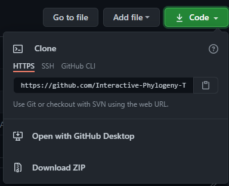
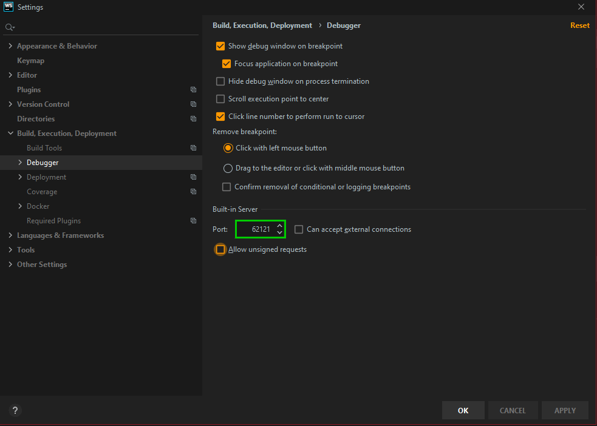
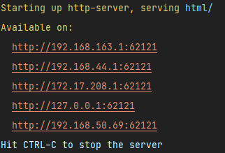
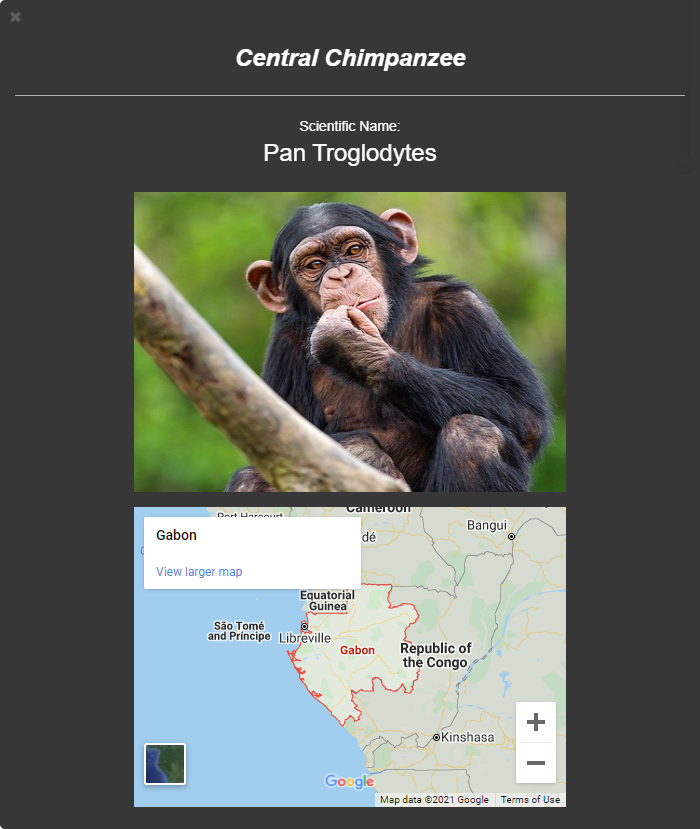
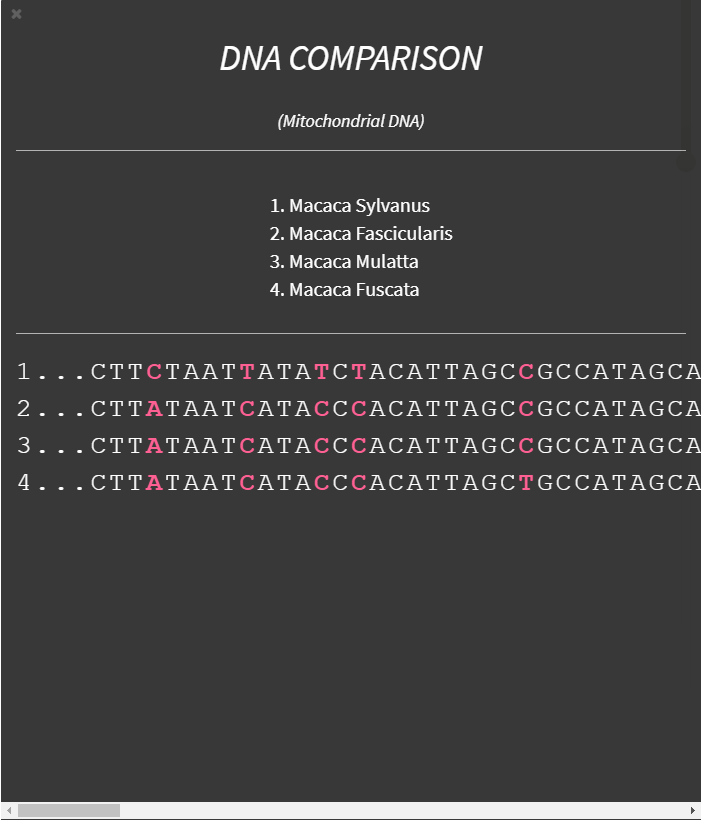

# QuickTree
***

### QuickTree's goal is to provide easy-to-use software that displays phylogeny in an education-focused evolutionary context.

## Table of Contents
### [Getting Started](#getting-started)
### [Features](#features)
### [License](#license)

## Getting Started
### 1. Clone the repo:

### 2. Set up the server and database following [this README](back-end/README.md)
> **_NOTE:_** Once you've set up the server and have run `npm start` from the backend directory, you should see `Backend server listening at 4000` in the terminal

### 3. Serve the frontend

### WebStorm IDE - Easiest
1. Open the project in WebStorm IDE (or clone it directly with WebStorm)
2. Go to Settings > Build, Execution, Deployment > Debugger and set the built-in server port to 62121

3. Open up *index.html* in the IDE and then select your browser in the little browser menu at the upper right corner.

  
### HTTP-SERVER
1. Make sure you install [NodeJS](https://nodejs.org/en/)
2. Go to the *frontend* directory. `cd frontend/`
3. Run `npm install http-server -g`
4. Once you've done that, serve the frontend by running `http-server html/ -p 62121`
> **_NOTE:_** The port **MUST** be **62121** (http-server defaults to 8080). If you don't use 62121, you will have CORS errors.
5. In the terminal you will have a list of URLs where the frontend is being served on, click one of them to get to the served site.

## Features

### SPECIES VIEW
#### Click on a leaf node to see the following features:
1. Common name
2. Scientific name
3. Picture of species
4. Interactive map of species origin

   
### DNA COMPARISON
#### Click on an intermediate node to see DNA comparisons between all leaf node species connected to the node.
> **_NOTE:_** The pinkish colored characters represent a change between at least one of the compared species.

## License
**MIT - Open Source**